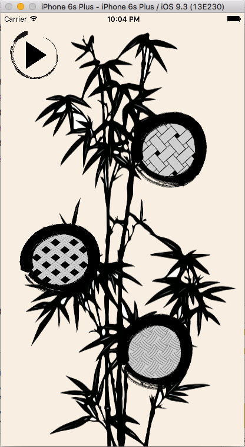
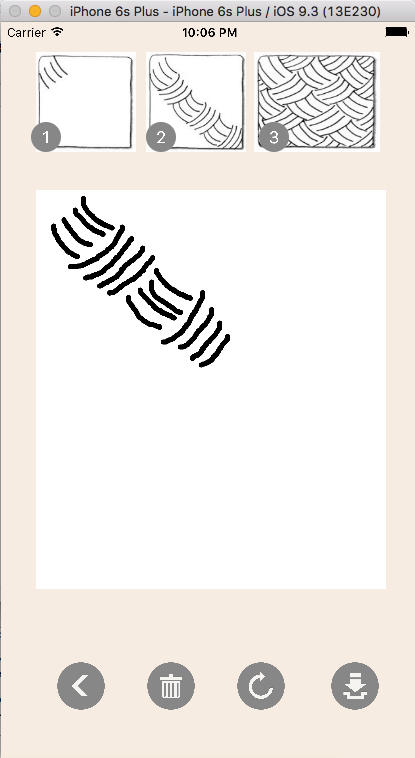

# ZenDoodle (for iOS)

#####(IN DEVELOPMENT)

## Version

1.0

## About ZenDoodle

ZenDoodle is a native mobile iOS app designed to help you find your inner zen through drawing simple, beautiful patterns.

Doodling - the spontaneous act of drawing, is a fantastic way to relieve stress, improve concentration,  and stimulate creativity.

There are no mistakes when ZenDoodling. Each stroke is the beginning of something new. Leave all expectations, criticisms, and comparisons behind during your ZenDoodle.

## Build Requirements
* Xcode 7.3 or later
* iOS 9.3 SDK or later
* iCloud–enabled provisioning profile
* App Groups–enabled provisioning profile

## Runtime Requirements
* iOS 9.1 or later

## Screenshots

## License

Copyright (C) 2016 ZenDoodle Inc. All rights reserved.
